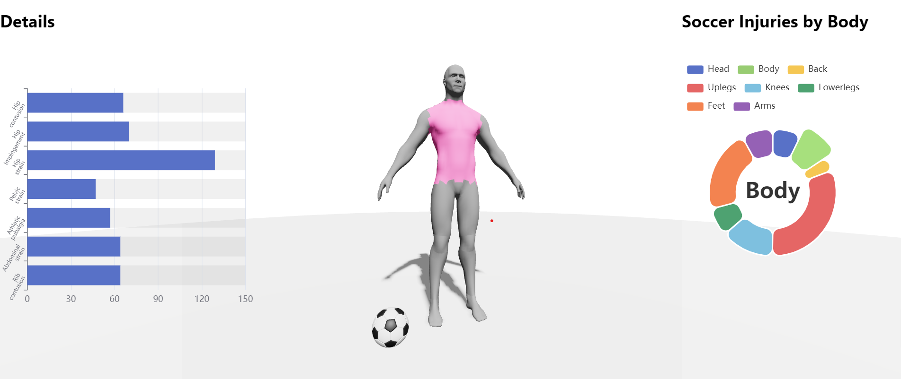

# Interactive Visualizer for Soccer Injuries by Body Region

This is a project for visualization course in 2023FALL ZJU

## Overview

This project implemented a 3D body viewer which can interact with user mouse activity, such as hover and click. The bodyparts will be highlighted and related data will be shown in the web when interacting with user.

## Screenshot

## Architecture

React + React_Three-Fiber(Three.js) + Echarts-for-React

## Procedure

- Use Blender to previously modify the model, divide it into several parts
- Use GTFL loader to import model
- Collect datasets from websites
- Integrate ECharts into React to visualize data
- Use React and Three.js to bind different body part with data charts
- Interact with different body region!